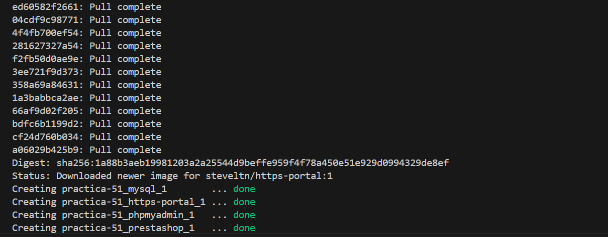
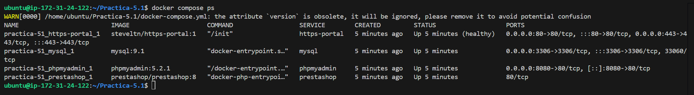
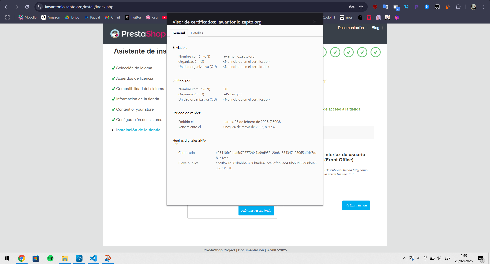
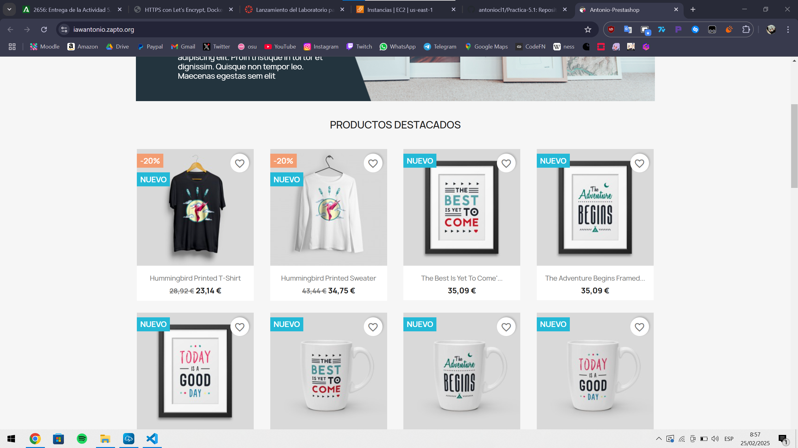

# Practica-5.1 HTTPS con Let's Encrypt y prestashop Docker y Docker-Compose

## Comprobaciones previas
- **1. Tener un dominio personalizado en NO-IP apuntando a la IP de la máquina donde ejecuto docker-compose**
- **2. Tener instalado docker y docker-compose en nuestra máquina**
- **3. Ejecutar los dockers con "sudo docker compose up -d"**
- **4. Eliminar los dockers con "sudo docker compose down -v"**

## Comprobaciones previas

